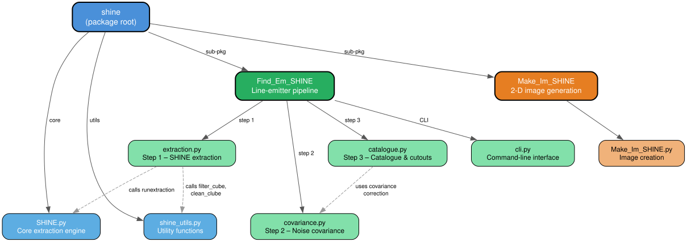
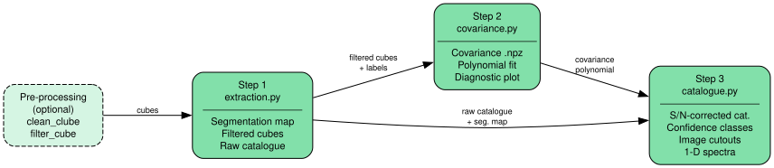

Code Architecture
=================

This page provides a visual overview of the SHINE package architecture,
showing how the modules relate to each other and what each one does.

High-Level Architecture
-----------------------

The diagram above shows the package tree with the main call dependencies.
Solid arrows indicate ownership (parent → child module); dashed arrows
indicate cross-module function calls.

Module Summary
--------------

.. list-table::
   :header-rows: 1
   :widths: 20 20 60

   * - Component
     - Module
     - Purpose
   * - **Core**
     - ``SHINE.py``
     - Extraction engine: filtering, thresholding, connected-component
       labelling, catalogue generation, photometry. Entry point:
       :func:`~shine.SHINE.runextraction`.
   * - **Utilities**
     - ``shine_utils.py``
     - General-purpose helpers: continuum subtraction
       (``clean_clube``), spatial/spectral smoothing (``filter_cube``),
       sub-cube cropping (``subcube``).
   * - **Find_Em_SHINE**
     - ``extraction.py``
     - *Step 1* — Wrapper around ``runextraction`` with emitter-optimised
       defaults; optional continuum subtraction.
   * -
     - ``covariance.py``
     - *Step 2* — Monte Carlo estimation of the empirical noise covariance
       as a function of aperture size and wavelength.
   * -
     - ``catalogue.py``
     - *Step 3* — S/N correction, quality cuts, confidence-class assignment,
       per-source image cutouts and spectral extraction.
   * -
     - ``cli.py``
     - Command-line interface that orchestrates the three steps from a
       single ``config.ini`` file.
   * - **Make_Im_SHINE**
     - ``Make_Im_SHINE.py``
     - Generates 2-D surface-brightness images from cubes and
       segmentation maps.

Find_Em_SHINE Pipeline Flow
----------------------------

The emitter-detection pipeline is designed to run sequentially in three
self-contained steps.  Each step produces output files that are consumed
by the next:

File Tree
---------

For reference, the on-disk layout of the ``shine/`` package::

    shine/
    ├── __init__.py               # Package root
    ├── SHINE.py                  # Core extraction engine
    ├── shine_utils.py            # Utility functions
    │
    ├── Find_Em_SHINE/            # Line-emitter pipeline
    │   ├── __init__.py
    │   ├── cli.py                # CLI entry-point
    │   ├── extraction.py         # Step 1 – extraction
    │   ├── covariance.py         # Step 2 – covariance
    │   └── catalogue.py          # Step 3 – catalogue
    │
    └── Make_Im_SHINE/            # 2-D image generation
        ├── __init__.py
        └── Make_Im_SHINE.py
