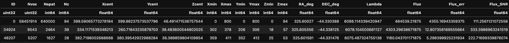
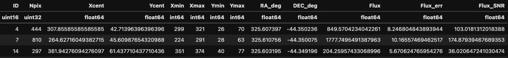

Core Extraction (``SHINE``)
===========================

The core extraction engine is performed using the `SHINE` module. The basic idea behind the code is as follows:

1. (Optional, applicable to 3-D data only) Select a portion of the cube (in the z-direction or wavelength direction) where the user wants to focus the extraction.
2. Mask certain voxels using a user-provided mask (e.g., continuum sources).
3. Spatially filter the cube/image and the associated 2-D or 3-D variance using a user-defined kernel dimension.
4. Apply a threshold to the cube/image based on the user-defined S/N threshold.
5. Group connected voxels (3-D) / pixels (2-D) that meet the S/N threshold and other user-defined parameters.
6. Generate and save the catalog along with the labeled cube/image.

Run Extraction from the command line
--------------------------------------

**Basic Usage for 3-D cube:**

.. code-block:: bash

   SHINE <3D-cube> <3D-variance>

- **Example (without selecting a subcube):**

.. code-block:: bash

   SHINE ../Cubes/Datacube.fits ../Cubes/Datavarcube.fits --snthreshold 2 --spatsmooth 3 --minvox 300 --mindz 2 --outdir ../Dataproducts/ --writelabels

- **Example (selecting a subcube):**

.. code-block:: bash

   SHINE ../Cubes/Datacube.fits ../Cubes/Datavarcube.fits --zmin 40 --zmax 100 --snthreshold 2 --spatsmooth 3 --minvox 300 --mindz 2  --outdir ../Dataproducts/ --writelabels --writesubcube

**Basic Usage for 2-D images:**

.. code-block:: bash

   SHINE <2D-image> <2D-variance>

- **Example:**

.. code-block:: bash

   SHINE ../Cubes/Dataimage.fits ../Cubes/Datavarimage.fits --snthreshold 2 --spatsmooth 3 --minvox 300 --outdir ../Dataproducts/ --writelabels

**Command line arguments for SHINE:**

*General Arguments:*

- ``-h, --help``: Show this help message and exit.

*Input Control Arguments:*

- ``data``: Path of the input data (3-D or 2-D). Expected to be in extension 0, unless ``extdata`` is defined.
- ``vardata``: Path of the variance cube. Expected to be in extension 0, unless ``extvardata`` is defined. If a positive number is provided a constant variance is assumed; if -1, the variance is computed from the data with a sigma-clipping algorithm.
- ``--mask2d``: (Optional) Path of an optional two-dimensional mask to be applied along the wave axis.
- ``--mask2dpost``: (Optional) Path of an optional two-dimensional mask to be applied after the spatial smoothing.
- ``--mask3d``: (Optional) Path of an optional three-dimensional mask. **(Not implemented yet)**.
- ``--extdata``: Specifies the HDU index in the FITS file to use for data extraction (default=0).
- ``--extvardata``: Specifies the HDU index in the FITS file variance to use for data extraction (default=0).
- ``--zmin``: (Optional) Select the cube and the variance: initial pixel in z direction (from 0). Only valid for 3-D data.
- ``--zmax``: (Optional) Select the cube and the variance: final pixel in z direction (from 0). Only valid for 3-D data.
- ``--lmin``: (Optional) Select the cube and the variance: initial wavelength in z direction (in Angstrom). Only valid for 3-D data.
- ``--lmax``: (Optional) Select the cube and the variance: final wavelength in z direction (in Angstrom). Only valid for 3-D data.

*Extraction Arguments:*

- ``--snthreshold``: The SNR of voxels (3-D)/pixels (2-D) to be included in the extraction (default=2).
- ``--spatsmooth``: Gaussian Sigma of the spatial convolution kernel applied in X and Y (default=0).
- ``--spatsmoothX``: (Optional) Gaussian Sigma of the spatial convolution kernel applied in X. Has priority over ``spatsmooth``.
- ``--spatsmoothY``: (Optional) Gaussian Sigma of the spatial convolution kernel applied in Y. Has priority over ``spatsmooth``.
- ``--specsmooth``: Gaussian Sigma of the spectral convolution kernel applied in Lambda.
- ``--usefftconv``: If ``True``, use FFT for convolution rather than the direct algorithm.
- ``--dovarsmooth``: If False, do not apply the smoothing on the vardata.
- ``--connectivity``: Voxel connectivity scheme to be used (default=26). Allowed values: 4, 8 (2-D); 26, 18, 6 (3-D).
- ``--maskspedge``: Determines how much, in pixels (default=20), to expand the mask around the edges of the cube/image.

*Cleaning Arguments:*

- ``--minvox``: Minimum number of connected voxels (3-D)/pixels (2-D) for a source to be in the final catalogue (default=1). For 2-D data this argument has priority over ``--minarea``.
- ``--mindz``: Minimum number of connected voxels in the spectral direction for a source to be in the final catalogue (default=1). Only valid for 3-D data.
- ``--maxdz``: Maximum number of connected voxels in the spectral direction for a source to be in the final catalogue (default=200). Only valid for 3-D data.
- ``--minarea``: Minimum number of connected projected spatial voxels (3-D)/pixels (2-D) for a source to be in the final catalogue (default=1).

*Output Control Arguments:*

- ``--outdir``: Output directory path (Default ./).
- ``--writelabels``: If set, write labels cube/image. The file is saved as ``dataname.LABELS_out.fits``.
- ``--writesmdata``: If set, write the smoothed cube/image. The file is saved as ``dataname.FILTER_out.fits``.
- ``--writesmvar``: If set, write the smoothed variance. The file is saved as ``varname.FILTER_out.fits``.
- ``--writesmsnr``: If set, write the S/N smoothed cube/image. The file is saved as ``dataname.FILTERSNR_out.fits``.
- ``--writesubcube``: If set and used, write the subcubes (cube and variance). Only valid for 3-D data. The file is saved as ``dataname.SUBCUBE.fits`` or ``varname.SUBCUBE.fits``.
- ``--writevardata``: If vardata is a user-provided constant value or -1 (auto-computed from sigma-clipping) write the variance.

Run Extraction using Python
-----------------------------

SHINE can be used also in Python scripts.

**Basic Usage for 3-D data:**

.. code-block:: python

    from astropy.table import Table
    from shine import SHINE

    # Extraction on the full cube
    SHINE.runextraction(
        '../Data/Datacube.fits', '../Data/Datavarcube.fits',
        snthreshold=2, spatsmooth=4,
        minvox=3000, minarea=1000,
        mask2d='../Data/2D_MASK.fits',
        mask2dpost='../Data/2D_MASK_post.fits',
        outdir='../Dataproducts/',
        writelabels=True, maskspedge=20,
        writesmdata=True, writesmsnr=True,
    )

    # Extraction on a subcube (by pixel index)
    SHINE.runextraction(
        '../Data/Datacube.fits', '../Data/Datavarcube.fits',
        zmin=40, zmax=100,
        snthreshold=2, spatsmooth=4,
        minvox=3000, minarea=1000, maskspedge=20,
        mask2d='../Data/2D_MASK.fits',
        mask2dpost='../Data/2D_MASK_post.fits',
        outdir='../Dataproducts/',
        writelabels=True, writesmdata=True, writesmsnr=True,
    )

    # Quick visualisation of the output catalogue
    catalogue3D = Table.read('../Outdir/Datacube.CATALOGUE_out.fits')

   Catalogue output from 3-D extraction (Example).

**Basic Usage for 2-D data:**

.. code-block:: python

    from astropy.table import Table
    from shine import SHINE

    # Attention! Remember to change connectivity to 4 or 8 for 2D data.
    SHINE.runextraction(
        '../Data/Dataimage.fits', '../Data/Datavarimage.fits',
        connectivity=8, snthreshold=3, spatsmooth=1,
        minvox=40, maskspedge=20,
        outdir='../Dataproducts/', writelabels=True,
    )

    catalogue2D = Table.read('../Outdir/Dataimage.CATALOGUE_out.fits')

   Catalogue output from 2-D extraction (Example).
